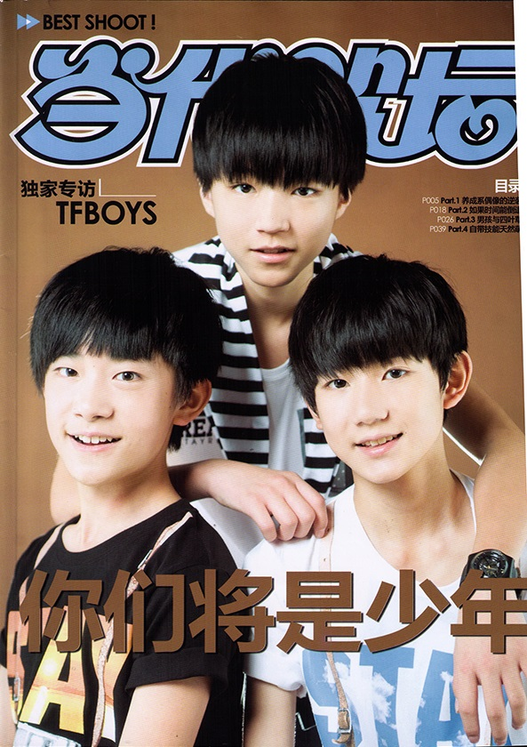
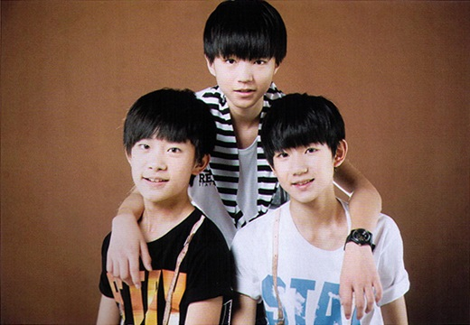

**Modern Music Field(当代歌坛) No.597**

---

**P00**

# You Will Be Youths

It seems as if the three boys came into the public just overnight.
For those who are unfamiliar with them, they are confused about these boys who can be frequently seen from "Hot Weibo Posts Chart":
Who are they? Why are they popular? Where do they differs? -- Many questions pour out.
For those who follow them from TF Family started out, they feel complicated:
It's sad that the boys will be noticed and loved by more people, not their "own" anymore;
it's glad that the boys will be noticed and loved by more people, their efforts count, once seemingly endless dream-chasing road broadens in a sudden, the time-polished jade is now emitting its first ray.

---

*P01*

Nothing is more wonderful than companionship.
It's lucky to accompany them from they started out, but it's still okay to start taking a look from now on.
The past is gone, but the future is waiting in the front.
They are still "boys" aged 13 or 14, not enough to be called "youths".
They are experiencing the best time in life, don't you want to join their growth?

---

*P02*

YI Yang-qian-xi(易烊千玺, Jackson)

He's a Sagittarius boy born in 2000, the dancer.
He's shy in front of strangers, with the eyes like a deer's.
While at other times, he will be very calm.
He danced Latin for many years, but now LA Style.
His little body stores great power, which makes him totally different when he's dancing.
When the dance stops and the pose freezes, and the fans scream, he will be the most fulfilled.
He is a fan of G-Dragon.
Everyone knows he loves his younger brother very much.
His family, other group members, and his dancing bros, are the most precious for him.
He is calm just because he's a late-adopter.

---

*P03*

WANG Yuan(王源, Roy)

He's a Scorpio boy born in 2000, the vocalist.
He's a smart boy, TF king of fashion, and TF king of gags.
He's the most sensitive one to cameras.
It's hard to wake him up.
He has insistent of singing, and is dare to challenge the pitch beyond his range.
He's good at musicality and stage manners.
He already has the competency of an entertainer, and acts like an entertainer the most among the three.
Unlike Karry's cool and Jackson's late-adopting, Roy is naughty, lively, and active.
He's the indispensable activator in the group.
Everyone knows he cares about fans very much, and keeps smile all the time.
He's really an angel.

WANG Jun-kai(王俊凯, Karry)

He's a Virgo boy born in 1999, the leader.
He's good at both singing and dancing.
Even the camera will feel thankful to his nice looks and fine figure.
He has huge vigour and charisma, but describes himself as "countrified" (-皿-).
He likes playing gags, but Roy always beat him easily.
He wants to be a singer-songwriter as Jay Chou.
He joined the agency unintentionally and stood out from many trainees.
He's family-centred, filial, and responsible.
He's reserved but frank, he says no verbose or roundabout words.
You'll find him cool and calm at first, but later, warm and passionate at the same time.
He's mysterious.

---

*P04*

N/A

---

*P05*

**Part 1**

# TFBOYS
# COUNTER-ATTACK

This is a paper prepared for those who have trouble in explaining "why do you love TFBOYS", and for those who are asking "who are they, why are they so popular".

Idols in mainland China are in a poor situation.
There's no sound industry, no complete system, no integrated chain.
It's hard to survive in this market though it's large.
Johnny & Associates of Japan, where Asian teen idols originated, is just cultivating its own earth.
Korean male idol groups are sweeping here, but there lacks a style of "bright and shiny teens in slim figures".
At this time, TF Family pushed out a "cultivated" teen idol group TFBOYS, following Japanese locating mode and Korean training method.
This filled a gap in idol market of mainland China and even Chinese.
"Cultivated" idols have widespread audiences -- females, no matter young or old, like handsome boys who are charming and attractive as if they were the heroes of manga, are willing to accompany the boys’ growth, imagine their personality, immersed and enjoyed.
As for the age of the boys -- who cares?
In addition, thanks to the popularity of "grass-roots media" in this network era, TF Family regularly releases their show "TF Teens GO!"(TF少年GO！) in which TFBOYS attended on the Web and was greatly spread.
The short play "Study Room In Boys' School"(男生学院自习室) in the show is more attractive to countless elder sisters.
TFBOYS, who didn't raise much concern when they debuted last year, finally came back from the Web to the public, attracted a large number of crazy fans, accomplished a nice counter-attack.
It's objective that some entertainment practitioners take them as "phenomenal idols".
TFBOYS get popular in their locating, timing, and daring to be the first.
Those who are concerned about fashion and vogue may doubt about and be surprised at their popularity, but the three boys' faces and names have already been known to all.
There's no doubt that they are too young and weak in strength, but just because they are young, there will be boundless possibilities in their future.
The rookies are not just specialized in fearlessness -- when they are exploring the world in curious, when they are chasing their dreams in vigour, you will probably be infected and stretch out your hand to help, due to their pureness and youthfulness.

---

*P06*

## Little Boys, Huge Goals

They are trainees, students, entertainers, stars, idols; they are TFBOYS, who aged less than 14 on average.
WANG Jun-kai and WANG Yuan study, live, and take training in Chongqing, while YI Yang-qian-xi in the capital, more than a thousand kilometres apart, but they cooperate very well.
They are young but have clear goals, they want to be better, be stronger, and be liked by more people.
They have been and are being criticized as too young to sing well and dance orderly, they are facing many doubts.
Therefore, they are longing for acceptance.
"We want to be recognised, rather than be praised." -- Plain words, but full of honesty and eagerness.
They would be quite happy even to be simply commented as "they danced well" or "they will be better".
As in a group, they have different talents, can be complimented from each other, and should be combined to be better.

---

*P07*

*[Q - Xiao Dang(小当, the magazine), K - Karry(WANG Jun-kai), R - Roy(WANG Yuan), J - Jackson(YI Yang-qian-xi)]*

**Q:**
How did you become trainees?  
**K:**
I? (Looked down for two seconds.)
I didn't intend to, I was accidentally caught (found), and passed the audition.
I became interested in over time, and went on training.  
**R:**
To tell the truth (spoke in loud and refreshing voice), it was said that the training is free, so I went there to "jian pa huo"(Chongqing dialect, means "get unearned gains").
(Their manager sitting aside covered her face.)  
**J:**
I want to stand on the stage, so I went to be a trainee when I was given the chance.

**Q:**
What did you remember deeply as a trainee?  
**K:**
The dance training task is quite heavy, and I have no basics.
I cried in leg stretching and pressing on the first day.
I tried hard to hold my tears after that, but it's quite toilsome.  
**R:**
I was focused on singing at first, didn't practise dancing with others in the first half year, lagged far behind when I started to dance.
So I'm amplifying my effort to dance.  
**J:**
The amount of my dancing exercises is already large at first, and is now increased to more than 5 hours a day, 3 days a week.
It's really hard, but I got used to it and enjoyed it gradually.

**Q:**
The signing in Guangzhou agitated from the welcome at the airport, what surprised you in this trip?  
**K:**
There was an interview in the interval of the signing, and we should walk from the stage to the interviewing room which is only half a minute away.
The fans surrounded us all the way, and it took ten minutes.  
**R:**
I was greatly impressed, and was grateful to all the fans there.

**Q:**
What's your feeling about "the price of popularity"?  
**K:**
I should go home at noon after class, but I can’t (T T).
Fans are always following, even on the metro. I can do nothing but change my route.  
**R:**
My school is open to outsiders, many fans come to see me whenever I'm in or after class.
My teachers are very embarrassed to deal with the matter.  
**J:**
Some fans come to my school to give me presents, and leave quietly.
I'm rarely followed.  
**K:**
They don't come into school, because my school is closed at class times, they can't come in.
They all stand by the guardrail.
When I'm staying around such as walking on the playground, they will...  
**R:**
They will scream:"Karry's so charming!"

**Q:**
How did you know this, Roy?  
**R:**
His school nears mine, and is on my way home.
When I hear the scream when passing by, I will cover my face with a mask and walk away in a hurry.
(Shrank his shoulders and covered his face. So CUTE!)

**Q:**
What do you want to say to your fans "Clovers"?  
**K:**
"Thanks" are all we can say.
So many people support us unconditionally, and they have to wait a long time to meet us every time, we have no reason not to be thankful, we have no excuse to slack off.
Further on, the "Clovers" can...  
**Q:**
(They) can give you more love?  
**R:**
Hahahahaha. Yes.

**Q:**
Which is the most fulfilled works until now?  
**All:**
Definitely "Heart"!  
**K:**
We are mostly singing sad love songs before that.
Actually, it's difficult to get the meanings of the lyrics.
From this song, we successfully challenged dance music.
We are, really fulfilled.

**Q:**
How were you going in the recording studio?  
**R:**
When we had a recording, Qian-xi would come to Chongqing, and we would stay in the studio for a long time, help and supervise each other.

**Q:**
And what was the most difficult part in "Magic Castle"(魔法城堡)?  
**K:**
There are many high pitches.  
**J:**
Many accords.  
**R:**
It seems plain, but we recorded seven or eight tracks.

---

*P08*

**Q:**
What was your first impression to the member on your right?  
**K:**
WANG Yuan? Fat and reserved.
He had a round face, and he bowed when we first met -- it's really funny to recall the scene.
(Smiled with canine teeth.)  
**R:**
Qian-xi?
(J: Don't mention the hair.)
I'm very casual.
I found his hair was centre-parted when I first met him, so I yelled "zhong fen ge"(中分哥, literally means a man who's hair is centre-parted).
And then, the name spread out.
(Qian-xi stared at Roy, bit his lips innocently.)  
**J:**
Karry? When we first met, he was sitting on the sofa with a guitar, looking at me without emotion.
Then... then I turned away.
(Three seconds silence.)

**Q:**
OK... Well, tell us something we didn’t know about the member on your right.  
**K:**
When WANG Yuan is calling a taxi, his motion and voice are quite exaggerated.
(Q: Waving and shouting like "Taxi! Look at me!"?)
Yes, yes.
(Smiled with canine teeth again.) Ah, you are acting very well.  
**Q:**
... (I knew it's a praise, but it didn't seem worth delighted...)  
**R:**
Qian-xi is really cold sometimes, he may stop talking with no sign, makes it difficult to go on.  
**J:**
About Karry? Singing while walking.

**Q:**
How about the acting skills of the member on your right?  
**K:**
Roy may be the best among us.
He gives us a feeling of "I am the star".  
**R:**
Qian-xi's skills need to be improved.
He puts much effort into dancing, only has the chance when he comes to Chongqing.
He needs more practice.  
**J:**
I haven't seen Karry acting yet.

**Q:**
Where have the member on your right changed?  
**R:**
(Pushing Karry.) Say I'm becoming more handsome!
(Q: Let him say on his will!)  
**K:**
In the last year?
He's becoming more cared about preening.
(Elbowed by Roy.)
Ah. Well, more cared about his image.  
**R:**
Qian-xi is now more alive.
I remember that when he came to Chongqing for the first time and took vocal lessons, he's very passive, didn't dare to open his mouth, and his face turned totally red.
Now he's quite bold to sing and sings well, and even playing gags on Lao WANG(Karry) and me to the point.
It feels really good.  
**J:**
Karry's having more smiles on his face.
You won't know how cold he is when I acquainted with him.

**Q:**
How about the fashion sense of the member on your right?  
**K:**
(With grievances.) Don't talk about me on this, I'm a "tu ba"(土霸, a fans jargon, literally means one who is countrified all over)
(Wait, you are quite familiar with this fans jargon.)
WANG Yuan and Qian-xi are both good at this.  
**R:**
... Qian-xi's wear is simple but special.  
**J:**
My clothes are just basic matches.
I don't have to spend much thought on it, because I just go to the school and the dance club every day.
WANG Yuan has a good style in the selection of clothes.
And Karry (glanced at Karry) ... Well, pass.

---

*P09*

## Discover of "Phenomenal Idols" in Depth

This title is a bluff.
It is actually a "meng"(萌, means cute or adorable, derived from Japanese word "moe")-style group crosstalk on two subjects.
These questions were answered in the sequence of the seats -- from Karry to Roy, to Jackson, and back to Karry.
This dialogue across different ages and "jigens"(次元, literally: "dimensions", animation terminology from Japan) was too funny to be just written on papers.

Warning: This part contains materials that is too adorable, reader discretion is advised.

---

*P10*

## "Meng"-Style Crosstalk

These questions were prepared beforehand, but Xiao Dang really want to have a one-on-one talk with Roy...
Almost all his answers and all the things he uncovered showed a feeling of natural or "haraguroi"(Japanese word which means "with sneaky intent behind one's surface" but is used as a positive adjective).
Unlike Karry's regular answers and Jackson's limited words, Roy's activity made the boys' unknown characters discovered.

---

*P11*

**Q:**
Boys usually don't like to be described as "meng", so in your opinion, which word suits you?  
**K:**
... Well... Handsome?  
**Q:**
What are you hesitating about? What about Roy?  
**R:**
... Tall and slim.  
**Q:**
What a special word. And Jackson?  
**J:**
Handsome.

**Q:**
How did you look like two years ago? Already handsome?  
**R:**
Karry is ... short, and his hair's short.  
**K:**
Roy is fat. I haven't seen Jackson then.  
**J:**
Two years ago? I'm dancing alone every day.  
**R:**
He's handsome, he dances very well.

**Q:**
Where would you like to go if you have a vacation?  
**All:**
Hong Kong!  
**K:**
I would like to go to the beaches there, it must be very comfortable.  
**R:**
I will take a good shopping, buy all I want.
(Seemed as a rich.)  
**J:**
It's good to go wherever they want.

**Q:**
Who is good at playing gags, at spoiled actions, and at jokes?  
**K&J:**
There's no doubt, each of the three is WANG Yuan.  
**K:**
When WANG Yuan doesn't want to do something or he want something, he will shake his body and say "ah-i-ye"...
(Karry was showing the shaking, Roy pinching his arm, Xiao Dang and Jackson seeing them with poker faces.)

**Q:**
(Swung back the mind.) Who is grumpy in wake-ups?  
**K:**
Qian-xi and WANG Yuan are, especially WANG Yuan.
He will lose temper or get angry when someone wakes him up.
It was very hard to wake him up and start shooting when we were in Guangzhou.  
**Q:**
How did he wake up at last?
By the smell of the green pepper you were eating, or something else?  
**R:**
I couldn't sleep because his chopsticks were close to my nose.  
**K:**
But you lay down again, didn't you?

**Q:**
Who is often overexerted?  
**K:**
None of us will overexert on something...
We are, just okay. Heiheihei.
(Smiled with canine teeth for the third time.)

**Q:**
Who has a strong mood swing?
Like... being quiet at first, and noisy suddenly.  
**K:**
We are all of this kind, right?  
**J:**
Like, smiling at first, and crying suddenly.  
**R:**
... (Shrugging.)

**Q:**
Karry is good at cooking noodles, Roy is good at cooking instant noodles.
What about Jackson?  
**J:**
Eat.
(Straight to the point!)

**Q:**
Which song won't you miss in a karaoke box?  
**K:**
Jay Chou's "Silence"(安静).  
**R:**
"The Most Dazzling Folk Style"(最炫民族风, also translated as "The Hottest Ethnic Trend").
(Xiao Dang agrees with you.)
You get it, don't you?
It's the best song to boost people higher.
Once I feel others in the box is down, this song always reverses the air.  
**J:**
ZHANG Jie(张杰, also known as Jason ZHANG)'s songs.
(Q: What about G-Dragon?)
That's too difficult.

**Q:**
Who's your favourite singer at present?  
**K:**
Avril Lavigne.  
**R:**
G.E.M.(Gloria Tang Tsz-kei, 鄧紫棋)  
**J:**
G-Dragpn and G.E.M.  
**K:**
All of us like G.E.M., she's great at singing, and powerful on stage.

**Q:**
(For leader:) What's your expectation of the group?
(For other members:) What do you want to say to your leader?  
**K:**
We should go on in harmony.
(Xiao Dang's thought: You really mean literally "harmony"?)
And, our goal of this year is -- to have more than 5 million fans.  
**J:**
Karry, we are following your lead.

---

*P12*

**Supplement: Sidelights of the Shoot**

## Easy to Become Younger

It's the first time for them to take shooting and interview like this, all the three were very reserved at first,
especially the "late-adopter" Jackson -- Xiao Dang's photographer had to told him how to pose all through.
But when you were explaining, he would stare at you like a deer, and follow your guide in a shy way.
That was adorable!
Roy's shoot is much better -- he's expressive and smart enough to follow our direction.
When Karry's on stage, his delicate profile and long eyelashes made a deep impact.

After the first round finished, the three got the sense and became more active.
The shooting properties included Band-Aids with patterns of Rilakkuma, Doraemon, and One Piece.
When saw the props, all the three chose the ones with One Piece.
Three boys with Band-Aids on the face, smiling vigorously, surrounded by brightly-coloured patterns
-- this lively scene was filled with adorable elements, which prompted Xiao Dang to immerse in the atmosphere.

The three were very nervous in the interview, held the voice recorders tightly, spoke in a low voice.
Just several minutes later, Karry's recorder beeped and was turned off because he held too tight...
They broke into a laugh, and became relaxed.
And some time later on, Karry laughed too hard that he had to press his stomach.
Laughed out hard and impressed adorable strongly, were the common feelings of Xiao Dang and our photographer.

How important is the working environment.
To be fellow with teens often, it would be easy to become younger.

---

*P13-15*

N/A

---

*P16*

## Supplement: Sidelights of the Award Ceremony

* The three boys were very nervous when walking on the red carpet.
It's easy to tell from their somewhat stiff body movements -- the occasional homo-lateral patterns were really adorable.

---

*P17*

* Karry was so excited when they got the first award that the trophy was close to Roy when he raised it.
Luckily Roy ducked away in time.

### "Meng"-style Nutcracker Group

When we communicate with their manager about clothes for this shoot a month ago, what we got was the sizes of the suits they would wear at Yinyuetai(音悦台)'s award ceremony.
By the time they stood at one end of the red carpet with these suits, they looked just like "meng"-style nutcrackers, real "Clamp School Detectives".
Facing the first red carpet in life, facing all the crazy screaming fans emerged overnight, they were walking, signing, being interviewed and photographed with spirit, but were also nervous.
But Karry said, "It is a good chance to show us on this large stage, we will appreciate it."
The stadium held over 10,000 people, they didn't fear though quite nervous, and lit up with pleasure when received "The Most Popular Singer Award".
Praise and recognition can bring them great happiness and inspiration, because they are simply boys after all.
When seeing their great popularity in the stadium, critical media in Beijing were surprised and doubtful.
However, when recording videos with very long words, which was hard for even adult entertainers, they passed once.
People realised that there were something about youth, vitality, and possibility.
