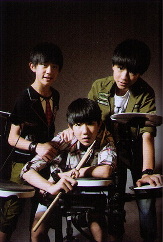
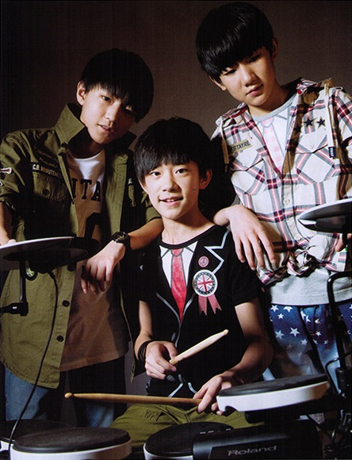
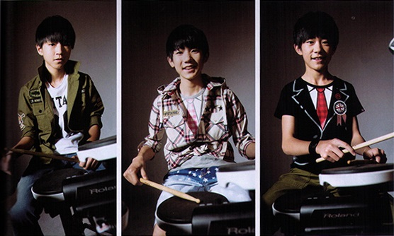

**Modern Music Field(当代歌坛) No.597**

*P18*

**Part 2**

# IF TIME GOES BACK

Too many fans came in recent months.
Although TFBOYS' debut was not long ago, the missed memories were always regretful.
The time doesn't go back, we cannot return to their starting point and retrace their route.
But we have recordings to review the past, to see the immature performances, the surprises of the growth, and their appearances...

Let's turn back to feel their past, and tell ourselves: we'll never miss their future.

## First Impression

**Karry**

**Covers of "Qiu Niao"(囚鸟, literally: "A Bird In Cage") and "Wo Yao Kuaile"(我要快乐, literally: "I Want Happiness")**

Karry covered "Qiu Niao" and "Wo Yao Kuaile" in early 2012, the videos brought about a large number of reposts and comments on the Internet.
In the videos, the little boy stood in the recording room, wore a large headset, showed a sense of unease when the prelude began.
But once he started singing, the whole world went silent.
Such a little boy's expression delivered different feelings.
These two videos' hits boosted quickly and appeared in the recommendations of a video site's homepage.
Karry came into the public, and each of his covers later was the site's hot video, the netizens' focus.

**Roy**

**Cover of "Yige Xiang Xiatian, Yige Xiang Qiutian"(一个像夏天，一个像秋天, literally: "One Likes Summer, One Likes Autumn") with Karry**

Roy entered the agency later than Karry, he didn't have personal covers.
All the works were done with Karry.
The public first knew him in "Yige Xiang Xiatian, Yige Xiang Qiutian" covered with Karry.
The two boys stood in front of the camera, swaying with the lively rhythms.
Roy's furry hairs showed a feeling of tame.
But once he open his mouth, the voice was clear and attractive, which was an advantage in singing with high pitches.
The performance was immature, but Roy acted like a star.
This video got 5 million hits, and was even reposted by the original singer.
The influence was unquestionable.

**Jackson**

**Personal Single "Mengxiang Motian Lou"(梦想摩天楼, literally: "Dream Skyscraper")**

Jackson released his first single "Mengxiang Motian Lou" in 2013.
In the MV, he wore curly hairs, fashion clothes and black scarf, walking on the city streets, looked dignified like a grown-up.
This is the first single after he entered TF Family.
However, Jackson had appeared in front of the public long before that -- he constantly attended in children's TV shows and dance contests from 2005, as well as dramas and ads.
So, when he debuted as a member of TFBOYS, not only Xiao Dang thought he looked familiar.

---

*P19-21*

N/A

---

*P22*

## TFBOYS' New Impression

Now, TFBOYS are not those little boys covering songs beyond the screen.
The outlines of their figures are more defined and shaped, and they grew taller.
They released the first EP "Heart Meng·Chufa"(Heart梦·出发, literally: "Heart, Dream Starts Off"), in which all the three songs reached the top of a chart, and got over 10 million hits in a music video site.
It was the utmost encouragement for not largely promoted rookies.
In an award ceremony this April, TFBOYS defeated other groups, and got the award "The Most Popular Singer in Mainland China".
When the fans were cheering, they said, "We will keep fighting. Thank you, all our fans."
At present, TFBOYS not only regularly appears in TF Family's show "TF Teens GO!" and "Study Room in Boys' School", but were also invited to many performances and shows across the country.
As Karry was preparing for the High School Entrance Examination, TFBOYS didn't attend many.
However, seeing the exciting and dramatic appearances of the fans when talking about the three boys, it is convinced that their solo concert will not be far away.

---

*P23*

## About TF Family

### The Agency

The Agency that made TF Family -- Time Fengjun Entertainment(时代峰俊文化艺术发展有限公司) -- started off from Chongqing, was originally aimed at cultivating children's interests and specialities.
However, some children were really extraordinary, it was a waste not to exploit their potential.
So the agency tended to form their own style, as the top of the agency had studied the training systems of Japan and Korea.
After some time of practice, TF Family took shape and the boys got more popular than expected.
Then, the agency sited in Beijing arose, took charge of the propagation across the country.
While at the same time, the base stayed in Chongqing, the boys' training also remained there.
Moreover, branches in other region are already on the agenda.

### TF Family

TF Family is a training department of Time Fengjun in Chongqing and the brand of the training.
It aims at recruiting boy trainees with good figures and overall quality, training them in art and performing.
The trainees are all little boys, thus many fans also call it "TF Zheng Tai Family"(TF正太家族).
TF Family created many novel training mode, such as covering famous songs, recording distinctive variety shows("TF Family News Report", "TF Family Face-to-Face", "Study Room in Boys' School", etc.).
These activities made chances for the boys to be recognised by the public, Karry and Roy of TFBOYS were exactly been known through this mode and debuted, and other trainees also gathered certain popularity here.

### Training Mode

TF Family's training mode is influenced by large entertainment agencies in Japan and Korea:
talent scouts seek potential stars, and persuade their parents to take the child to get training;
after the child performs well enough, the agency will decide the direction due to his/her character -- a solo singer, an actor, or an idol.
The advantage of TF Family's training mode is that the entertainer studies necessary skills and learns the hardship in the training, and can be recognised much earlier, which also guarantees the popularity after debut.
But TF Family won't occupy the boys' school time or normal growing experiences
-- the training is for free (Roy took a fancy to this = =);
the joining and signing definitely respect the boy and his parents opinion -- each trainee got signed after thorough communication.
The agency doesn't want them to give up study, but encourage them to develop in various aspects.
The agency is also growing, the training mode is constantly improving.

---

*P24*

## Five Doubts about TFBOYS

**Q:**
They rose to fame just overnight?  
**A:**
They didn't.
TFBOYS came from TF Family which was found in 2009.
TF Family recruited six trainees in 2010, released their training progress via the Internet.
This imitation of Johnny's failed.
In the early 2010, only OU-YANG Wang-ge(欧阳王戈), WANG Jun-kai, ZHANG Xiao(张啸), and WANG Yuan stayed, and joined TF Family.
It was too long for the investors to get the profit after 20 years [which the agency originally expected], that TF Family was close to be dissolved.
However, a talent show on the web turned things around -- WANG Jun-kai's cover of "Qiu Niao" raised people's concern, and so did WANG Yuan and WANG Jun-kai's cover of "Yige Xiang Xiatian, Yige Xiang Qiutian".
Later on, TF Family's cover of "Yangcong"(洋葱, onion) had been reposted by its original singer Ashin(阿信), and raised great concern.
And YI Yang-qian-xi joined at that time.
In the mid-2013, TF Family started the group TFBOYS with WANG Jun-kai, WANG Yuan, and YI Yang-qian-xi.
And they got more and more popular thanks to their own variety show on the Web.
It can be recognised from the amount of their Weibo account's reposts and comments clearly that their popularity soared from that time.

**Q:**
They got popular through "shipping"[or "pairing", or "coupling", a fandom jargon]?  
**A:**
After the debut, the link between WANG Yuan and WANG Jun-kai became a weapon to hype new fans.
In "TF Teens GO!", they first pair with different trainees to talk with YI Yang-qian-xi on the phone, but later, Roy and Karry became the fixed partners to show the group in its entirety.
This natural and pure emotion among children was more appealing, compared to the story of "Little Onion Looking for Mummy".
[The cover of "Yangcong" was intended to find a trainee's mother.]
WANG Jun-kai and WANG Yuan led the fans to know TFBOYS better, and then YI Yang-qian-xi.
This was practicable.
Since the fans like it, it would be better to infect more people using their real emotion.
So, they did not just get popular through "shipping".

**Q:**
They are hiring paid posters?  
**A:**
TF Family relied on the Internet, which was the best platform for one who have no guide or support.
The group have just started out, the agency was not well-off, what they have are just "free posters" who like them.
When in a popularity contest, TFBOYS won't lag behind.
Someone once joked that TFBOYS united fans of Chinese, Japanese, and Korean stars.
Looking at their tender faces, it's hard to control oneself not to pinch.

**Q:**
They have only good looks but no talents?  
**A:**
From scratch to much better, WANG Jun-kai experienced everything, he knows thoroughly and clearly.
So did WANG Yuan and YI Yang-qian-xi. WANG Yuan and WANG Jun-kai's covering was an important step for the group.
There wouldn't be those turning points without their covers in "Youku Niuren"(优酷牛人, literally: "Youku Talents").
At present, WANG Jun-kai will gradually stop his work when this issue is published, to prepare for the examination -- he scores quite well in study, though not as good as YI Yang-qian-xi.
YI Yang-qian-xi, whom the fans called "Qian Zong"(千总, literally: "Boss Qian"), is quite good at dancing, as well as Chinese calligraphy and taekwondo -- he already has eight years’ experience in show biz.

**Q:**
Their attractions?  
**A:**
TFBOYS age just 13 to 14.
They are young, have nice skins and pure eyes.
They looks good in school uniforms, as well as many different styles.
Their inexperienced performance on red carpet or on stage are adorable.
The interactions among them are natural, with no affectations...
Maybe that's why the fans crave for taking a glance at them at the airport.
Their attractions are all included in this issue.

### TFBOYS Timeline in Brief

- Oct. 2010, TF Family opened the Weibo account, gradually posted training and covering videos.

- Mar. 2011, WANG Jun-kai joined TF Family.

- May 2011, WANG Jun-kai contested in "China's Got Talent"(中国达人秀).

- Aug. 2011, TF Family released the first EP "Wo Bu Yao Gaibian"(我不要改变, literally: "I Don't Want to Change").

- Feb. 2012, WANG Jun-kai covered "Wo Yao Kuaile"(我要快乐, literally: "I Want Happiness") and "Qiu Niao"(囚鸟, literally: "A Bird in Cage").

- June 2012, WANG Jun-kai contested in "Up! Juniors"(向上吧！少年).

- June 2012, WANG Jun-kai attended in two episodes of "Tiancai Tongsheng"(天才童声, literally: "Best Children's Voice") of Liaoning TV(辽宁卫视).

- June 2012, WANG Jun-kai attended in "Wo Shi Chuanqi"(我是传奇, literally: "I am the Legend").

- May & July 2012, WANG Jun-kai attended in "Ni Zui Youcai"(你最有才, literally: "You are Talented") of Henan TV(河南卫视).

---

*P25*

- July 2012, WANG Jun-kai and WANG Yuan covered "Yige Xiang Xiatian, Yige Xiang Qiutian"(一个像夏天，一个像秋天).

- Sept. 2012, WANG Jun-kai covered "Wode Gesheng Li"(我的歌声里, literally: "In My Song").

- Apr. 2013, WANG Jun-kai and WANG Yuan covered "Dang Ai Yi Cheng Wangshi"(当爱已成往事, literally: "When Love Becomes the Past")

- May 2013, TF Family released EP "Jiewu Shaonian"(街舞少年, literally: "Hip-hop Teenagers").

- May 2013, WANG Jun-kai and WANG Yuan covered "Yangcong"(洋葱, literally: "Onion").

- Aug. 2013, TFBOYS released the promotion video "Shi Nian"(十年, literally: "Ten Years"), with the concept of striving for their dreams in ten years.

- Aug. 2013, TFBOYS released the MV of the first EP's top song "Heart".

- Oct. 2013, TFBOYS published the first EP "Heart Meng·Chufa"(Heart梦·出发).

- Mar. 2014, TFBOYS released "Magic Castle"(魔法城堡).

- Apr. 2014, TFBOYS was awarded "The Most Popular Singer in Mainland China" and "The Popular Singer in Yin Yue Live"(音悦直播人气歌手) in the second "Yinyue V-Chart Awards Ceremony"(音悦V榜年度盛典).
